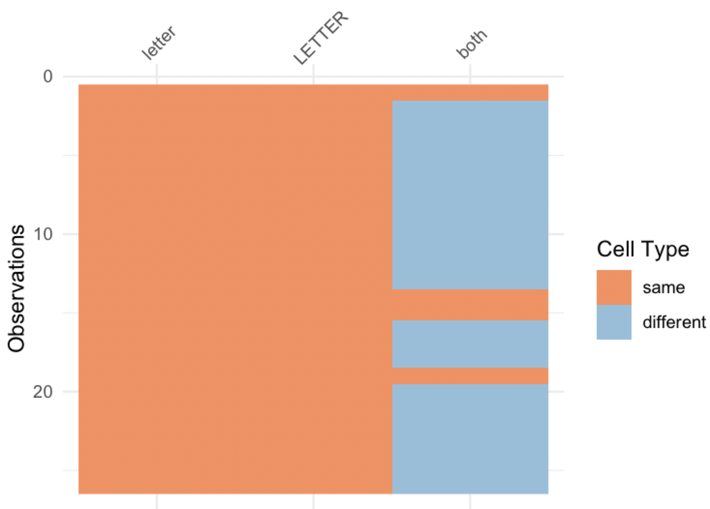
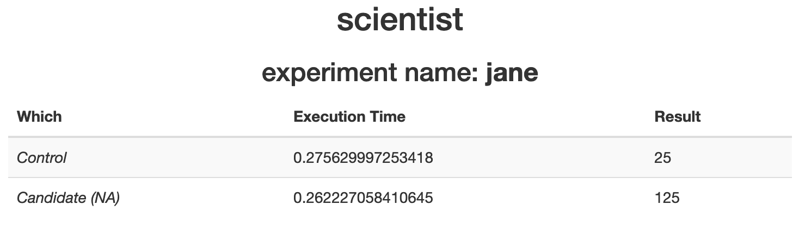

scientist
=========

```{r echo=FALSE}
knitr::opts_chunk$set(
  comment = "#>",
  collapse = TRUE,
  warning = FALSE,
  message = FALSE
)
```

[](https://www.repostatus.org/#concept)

__Experiment with changes in an R project__

Inspired by the Ruby gem [scientist](https://github.com/github/scientist) -
but instead of targeted at web apps, this project targets researchers/etc.
that want to compare changes in their code in a rigorous fashion.

## How is this different from X tool?

* git/version control: scientist does not play any part in managing or
dealing versions of your project. use git for that.
* unit tests: tests are meant for making sure changes you make to your code
don't change outputs. scientist is a sort of opposite to
unit tests in that it aims to tell you **how** changes in your code
**do change** the outputs.
* benchmarking/profiling: scientist isn't purely a tool for comparing how
fast your code runs, but it does include comparison of run times
as a tool for decision making about what version to use


## Use cases

<details> <summary><strong>Code block</strong></summary> <p>

You have some code. You want to make a change to the code,
and you have a few different ideas about what you'd like
to do. For example, you want to pre-allocate the size of the
data.frame to see if that saves time.

`scientist` can help you sort out changes by comparing how long
each version takes, and visually diff results.

Using `scientist` you can compare these two functions like:

```r
a <- Experiment$new(name = "compare_code")
a$control(v1 = {
  out <- data.frame(letter = NA_character_, LETTER = NA_character_,
    both = NA_character_, stringsAsFactors = FALSE)
  for (i in 1:26)
    out[i,] <- c(letters[i], LETTERS[i], paste0(letters[i], LETTERS[i]))
  out
})
a$candidate(v2 = {
  out <- data.frame(letter = rep(NA_character_, times = 26),
    LETTER = rep(NA_character_, times = 26),
    both = rep(NA_character_, times = 26),
    stringsAsFactors = FALSE)
  for (i in 1:26)
    out[i,] <- c(letters[i], LETTERS[i], paste0(sample(letters, 1), LETTERS[i]))
  out
})
a
```

Then we can run the "experiment"

```r
a$run()
```

The compare results

```r
a$diff()
```



</p></details>

### Scripts

You have an R script, let's call it `code.R`. Just as above with the code
example, you want to make a change to the script. Instead of using
code blocks as input, you can use file names.

Using `scientist` you can compare these two functions with:

```{r eval=FALSE}
b <- Experiment$new(name = "compare_scripts")
b$control(file = "code.R")
b$candidate(file = "code_new.R")
```

### Packages

You have a package, let's call it `foobar`. You want to change a function
in `foobar` called `stuff()`. You can make a new version of that function
called `stuff_new()`.

Using `scientist` you can compare these two functions with:

```{r eval=FALSE}
res <- Experiment$new(name = "compare_stuff")
res$control(stuff(x = 5))
res$candidate(stuff_new(x = 5))
```


## Install

```{r eval=FALSE}
remotes::install_github("ropenscilabs/scientist")
```

```{r}
library(scientist)
```

## Usage

Initialize an experiment

```{r}
res <- Experiment$new(name = "jane")
```

Set your control code block

```{r}
res$control({
  x = 5
  x^2
})
```

Set your candidate code block. You can have 1 or more candidates, which are
compared against the control.

```{r}
res$candidate({
  y = 5
  y^3
})
```

Now you can see some control and candidate details

```{r}
res
```

Run the experiment

```{r}
res$run()
```

Get the results

```{r}
res$control_result
res$candidate_results
```

Get all results plus timing data

```{r}
res$result()
```

Publish results - opens a page in your default browser

```{r eval=FALSE}
res$publish()
```



## Meta

* Please [report any issues or bugs](https://github.com/ropensci/scientist/issues)
* License: MIT
* Get citation information for `scientist` in R doing `citation(package = 'scientist')`
* Please note that this project is released with a [Contributor Code of Conduct][coc]. By participating in this project you agree to abide by its terms.

[](https://ropensci.org)


[coc]: https://github.com/ropenscilabs/scientist/blob/master/CODE_OF_CONDUCT.md
